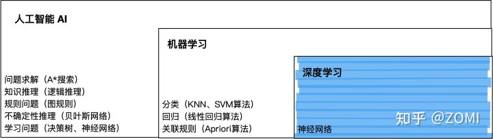

<!--
 * @Author: matiastang
 * @Date: 2021-12-15 11:42:46
 * @LastEditors: matiastang
 * @LastEditTime: 2022-08-05 16:25:04
 * @FilePath: /matias-AI/md/AI简介.md
 * @Description: AI简介
-->
[参考一](https://mp.weixin.qq.com/s?__biz=MzI3MTA0MTk1MA==&mid=2652036408&idx=2&sn=c02e42f64b8319fcff8812ac5298c993&chksm=f121a9c9c65620dfacecc918e5bc4b8e9ef5af61886b514fde7216dfffaca83115ec0659fc68&scene=21#wechat_redirect)
[参考二](https://cloud.tencent.com/developer/article/1422815)

# 发展史

## 感知机

神经网络技术起源于上世纪五、六十年代，当时叫`感知机（perceptron）`，拥有`输入层`、`输出层`和`一个隐含层`。输入的特征向量通过隐含层变换达到输出层，在输出层得到分类结果。早期感知机的推动者是`Rosenblatt`。

## 多层感知机

随着数学的发展，这个缺点直到上世纪八十年代才被Rumelhart、Williams、Hinton、LeCun等人发明的`多层感知机（multilayer perceptron）`。

多层感知机可以摆脱早期离散传输函数的束缚，使用`sigmoid`或`tanh`等连续函数模拟神经元对激励的响应，在训练算法上则使用`Werbos`发明的`反向传播BP算法`。这就是我们现在所说的`神经网络NN`。

多层感知机解决了之前无法模拟`异或逻辑`的缺陷，同时更多的层数也让网络更能够刻画现实世界中的复杂情形。
多层感知机给我们带来的启示是：**神经网络的层数直接决定了它对现实的刻画能力**，利用每层更少的神经元拟合更加复杂的函数。

### 神经网络

**神经网络并不是拟合任意函数，其数学理论建立在通用逼近定理（Universal approximation theorem）**的基础之上：

神经网络则是传统的逼近论中的逼近函数的一种推广。 **逼近理论证明[1]，只要神经网络规模经过巧妙的设计，使用非线性函数进行组合，它可以以任意精度逼近任意一个在闭集里的连续函数。**

## DNN深度神经网络

全连接的`DNN`存在几个问题

1. 参数数量的膨胀。
2. 无法对时间序列上的变化进行建模。
3. 随着神经网络层数的加深，优化函数越来越容易陷入`局部最优解`，并且这个“陷阱”越来越偏离真正的全局最优。

对于第一个问题：

全连接`DNN`的结构里下层神经元和所有上层神经元都能够形成连接，带来的潜在问题是参数数量的膨胀。假设输入的是一幅像素为1K*1K的图像，隐含层有1M个节点，光这一层就有10^12个权重需要训练，这不仅容易`过拟合`，而且极容易陷入`局部最优`。另外，图像中有固有的局部模式（比如轮廓、边界，人的眼睛、鼻子、嘴等）可以利用，显然应该将图像处理中的概念和神经网络技术相结合。于是就出现了`卷积神经网络CNN`。对于`CNN`来说，并不是所有上下层神经元都能直接相连，而是通过`“卷积核”`作为中介。同一个卷积核在所有图像内是共享的，图像通过卷积操作后仍然保留原先的位置关系。

对于第二个问题：

样本出现的`时间顺序`对于`自然语言处理`、`语音识别`、`手写体识别`等应用非常重要。为了适应这种需求，就出现了另一种神经网络结构——循环神经网络`RNN`。

在普通的`全连接网络DNN`或`CNN`中，每层神经元的信号只能向上一层传播，样本的处理在各个时刻独立，因此又被成为前向神经网络(`Feed-forward Neural Networks`)。而在`RNN`中，神经元的输出可以在下一个时间戳直接作用到自身，即第i层神经元在m时刻的输入，除了（i-1）层神经元在该时刻的输出外，还包括其自身在（m-1）时刻的输出！

对于第三个问题：

2006年，`Hinton`利用预训练方法`缓解`了`局部最优解问题`。

为了克服`梯度消失`，`ReLU`、`maxout`等传输函数代替了`sigmoid`，形成了如今`DNN`的基本形式。**单从结构上来说，`全连接的DNN`和图1的`多层感知机`是没有任何区别的。**

`高速公路网络（highway network）`和`深度残差学习（deep residual learning）`进一步避免了`梯度消失`。

### 高速公路网络（highway network）

### 深度残差学习（deep residual learning）

## CNN卷积神经网络

## RNN循环神经网络

`（t+1）`时刻网络的最终结果`O(t+1)`是该时刻输入和所有历史共同作用的结果！这就达到了对时间序列建模的目的。但`RNN`可以看成一个在时间上传递的神经网络，它的深度是时间的长度！`**“梯度消失”**现象又要出现了，只不过这次发生在时间轴上`。

为了解决时间上的`梯度消失`，机器学习领域发展出了`长短时记忆单元LSTM`。

## LSTM长短时记忆单元

**通过门的开关实现时间上记忆功能，并防止梯度消失**

## 双向RNN、双向LSTM

RNN既然能继承历史信息，是不是也能吸收点未来的信息呢？因为在序列信号分析中，如果我能预知未来，对识别一定也是有所帮助的。因此就有了`双向RNN`、`双向LSTM`，**同时利用历史和未来的信息**。

## AI框架

**AI框架给开发者提供构建神经网络模型的数学操作，AI框架把复杂的数学表达，转换成计算机可识别的计算图。**
**综上所述，AI框架最核心的是提供开发者构建神经网络的接口（数学操作），自动对神经网络训练（进行反向求导，逼近地求解最优值），得到一个神经网络模型（逼近函数）用于解决分类、回归、拟合的问题，实现目标分类、语音识别等应用场景。**

### AI框架的未来
针对AI框架的发展方向，目前主要看到三个方向：

1）深度学习与传统机器学习结合，比如深度概率学习、图神经网络等，这一块基本上业界的AI框架都已经支持。
2）计算图形相关的，类似Taichi这样的语言和框架，提供可微物理引擎、可微渲染引擎等。
3）未来是一个大数据融合的时代，传统的科学计算将会结合AI的方法去求解既定的问题。至于AI与科学计算结合，看到业界在探索三个方向。
3.1）一是AI建模替代传统的计算模型，目前已经有很大的进展了，如拿了戈登贝尔奖的分子动力学模型DeepMD。
3.2）二是AI求解，模型还是传统的科学计算模型，但是使用深度学习算法来求解，这个方向已经有一定的探索，目前看到不少基础的科学计算方程已经有对应的AI求解方法，比如PINNs、PINN-Net等，当然现在挑战还很大，特别是在精度收敛方面，如果要在AI框架上使用AI求解科学计算模型，最大的挑战主要在前端表达和高性能的高阶微分。
3.3）三是使用AI框架来加速方程的求解，就是科学计算的模型和方法都不变的前提下，与深度学习使用同一个框架来求解，其实就是把AI框架看成面向张量计算的通用分布式计算框架。

### Tensorflow

### Pytorch

**PyTorch 以它良好的扩展性和超高的实现速度，近年来已赢得了不少工程师的喜爱和赞赏。**首先，PyTorch支持GPU，代码的执行效率会明显提高。 另外，**在调整相比 TensorFlow 和 Caffe，PyTorch 拥有反向自动求导技术，自定义模型时不需要从头开始，可以大幅节约开发时间。**

此外，**PyTorch 的代码还比 TensorFlow 的代码更加简洁直观、友好易懂**，是一个非常优质的学习案例，可以帮助许多工程师更深入地理解机器学习。

### MindSpore

### Keras

### Caffe

## 技术选型

[Keras、TensorFlow和PyTorch的区别](https://www.163.com/dy/article/FIVPJBK70511DQI7.html)
[Keras、TensorFlow和PyTorch的区别](https://blog.csdn.net/yangshaojun1992/article/details/105129652)

API级别:Keras是一种高级的API，可以运行在Theano、CNTK和TensorFlow的顶层，后者因其快速开发和语法简单而受到关注。TensorFlow可以在API的低级别和高级别上工作，而PyTorch只能在API的低级别上工作。

框架的架构和性能:Keras的架构简单、简洁、易读，性能低下。TensorFlow是刚性使用，但支持Keras更好的表现。与Keras相比，PyTorch的架构复杂且难以解释。但TensorFlow 和PyTorch 的性能是健壮的，这提供了最大的性能，也提供了在更大的数据集高效率。由于Keras的性能较低，它只适用于较小的数据集。

调试过程:一个简单网络的调试是由Keras提供的，这是经常需要的。但是在TensorFlow中，调试是一个非常复杂的过程，而与Keras和TensorFlow相比，PyTorch提供了灵活的调试功能。PyTorch在神经网络中的操作描述了PyCharm、ipdb、PDB等调试工具的有效计算时间。但是当涉及到TensorFlow时，有一个叫做tfdbg的高级选项，它可以通过浏览所有的张量在特定的运行时在会话范围内操作。由于它是用python代码内建的，所以不需要单独使用PDB。TensorFlow在模式上比PyTorch先进，具有比PyTorch和Keras更广泛的群体。

框架的适用性。: Keras在小数据集中是首选，它提供了快速原型和扩展的大量后端支持，而TensorFlow在对象检测方面提供了高性能和功能，可以在大数据集中实现。PyTorch具有较强的灵活性和调试能力，可以在最短的数据集训练时间内适应。

神经网络框架的性能:PyTorch具有开发递归网络的多层和细胞级类。层的对象管理输入数据和一个单位单元中的一个时间步长，也表示具有双向属性的RNN。因此，由于没有进一步优化的必要，网络的众多层为单元提供了一个合适的包装。TensorFlow由dropout包装器、多个RNN单元和单元级类组成，用于实现深度神经网络。Keras由全连接层、GRU和用于创建递归神经网络的LSTM组成。

## AI 前沿

[AI 前沿](https://baijiahao.baidu.com/s?id=1729270582351670208&wfr=spider&for=pc)

编译优化-动静转换：**静态图在定义执行前的所有操作和网络结构，并将其呈现给传感器流，在训练期间提供了更高的性能，但这样做的代价是不易于使用、不够灵活。动态图计算是即时执行的，提供了更大的灵活性和更容易的调试，但这样做的代价是性能较低。`TensorFlow2.0`、`MindSpore` 等均支持`动态图`和`静态图`的转换技术，可以实现计算效率和灵活性的平衡。**

## 总结

事实上，不论是那种网络，他们在实际应用中常常都混合着使用，比如`CNN`和`RNN`在上层输出之前往往会接上全连接层，很难说某个网络到底属于哪个类别。