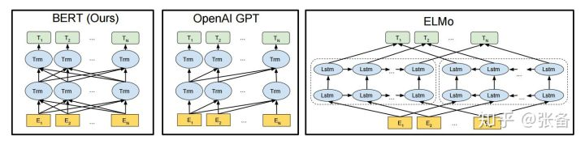

<!--
 * @Author: matiastang
 * @Date: 2022-08-05 15:00:20
 * @LastEditors: matiastang
 * @LastEditTime: 2022-08-05 15:41:16
 * @FilePath: /matias-AI/md/BERT.md
 * @Description: BERT
-->
# BERT

在介绍BERT之前，我们先看看另外一套方案。我在第一部分说过，BERT并不是第一个提出预训练加微调的方案，此前还有一套方案叫GPT，这也是BERT重点对比的方案，文章在这，Improving Language Understanding by Generative Pre-Training（https://s3-us-west-2.amazonaws.com/openai-assets/research-covers/language-unsupervised/language_understanding_paper.pdf）。GPT的模型结构和BERT是相同的，都是图2.10的结构，只是BERT的模型规模更加庞大。GPT是这么预训练的，在一个8亿单词的语料库上做训练，给出前文，不断地预测下一个单词。比如这句话，Winter is coming，当给出第一个词Winter之后，预测下一个词is，之后再预测下一个词coming。不需要标注数据，通过这种无监督训练的方式，得到一个预训练模型。

我们再来看看BERT有什么不同。BERT来自于Bidirectional Encoder Representations from Transformers首字母缩写，这里提到了一个双向（Bidirectional）的概念。BERT在一个33亿单词的语料库上做预训练，语料库就要比GPT大了几倍。预训练包括了两个任务，第一个任务是随机地扣掉15%的单词，用一个掩码MASK代替，让模型去猜测这个单词；第二个任务是，每个训练样本是一个上下句，有50%的样本，下句和上句是真实的，另外50%的样本，下句和上句是无关的，模型需要判断两句的关系。这两个任务各有一个loss，将这两个loss加起来作为总的loss进行优化。下面两行是一个小栗子，用括号标注的是扣掉的词，用[MASK]来代替。

正样本：我[MASK]（是）个算法工程师，我服务于WiFi万能钥匙这家[MASK]（公司）。

负样本：我[MASK]（是）个算法工程师，今天[MASK]（股票）又跌了。

我们来对比下GPT和BERT两种预训练方式的优劣。GPT在预测词的时候，只预测下一个词，因此只能用到上文的信息，无法利用到下文的信息。而BERT是预测文中扣掉的词，可以充分利用到上下文的信息，这使得模型有更强的表达能力，这也是BERT中Bidirectional的含义。在一些NLP任务中需要判断句子关系，比如判断两句话是否有相同的含义。BERT有了第二个任务，就能够很好的捕捉句子之间的关系。图3.1是BERT原文中对另外两种方法的预训练对比，包括GPT和ELMo。ELMo采用的还是LSTM，这里我们不多讲ELMo。这里会有读者困惑，这里的结构图怎么跟图2.10不一样？如果熟悉LSTM的同学，看到最右边的ELMo，就会知道那些水平相连的LSTM其实只是一个LSTM单元。左边的BERT和GPT也是一样，水平方向的Trm表示的是同一个单元，图中那些复杂的连线表示的是词与词之间的依赖关系，BERT中的依赖关系既有前文又有后文，而GPT的依赖关系只有前文。

讲完了这两个任务，我们再来看看，如何表达这么复杂的一个训练样本，让计算机能够明白。图3.2表示“my dog is cute, he likes playing.”的输入形式。每个符号的输入由3部分构成，一个是词本身的embedding；第二个是表示上下句的embedding，如果是上句，就用A embedding，如果是下句，就用B embedding；最后，根据Transformer模型的特点，还要加上位置embedding，这里的位置embedding是通过学习的方式得到的，BERT设计一个样本最多支持512个位置；将3个embedding相加，作为输入。需要注意的是，在每个句子的开头，需要加一个Classification（CLS）符号，后文中会进行介绍，其他的一些小细节就不说了。