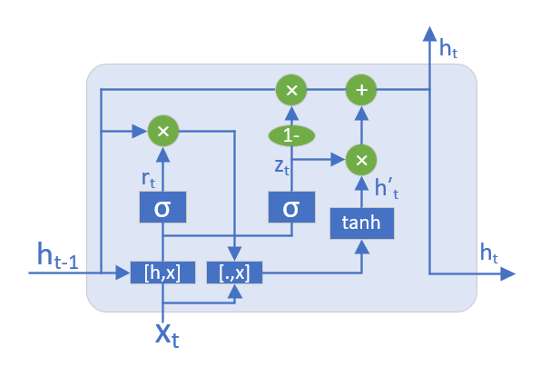

<!--
 * @Author: matiastang
 * @Date: 2021-12-15 11:41:50
 * @LastEditors: matiastang
 * @LastEditTime: 2022-08-08 17:15:04
 * @FilePath: /matias-AI/md/RNN/GRU.md
 * @Description: GRU
-->
# GRU

[LSTM和GRU的解析从未如此通俗易懂（动图）](http://www.360doc.com/content/19/0330/20/7669533_825345291.shtml)

LSTM 存在很多变体，其中门控循环单元（Gated Recurrent Unit, GRU）是最常见的一种，也是目前比较流行的一种。GRU是由 Cho 等人在2014年提出的，它对LSTM做了一些简化：

* GRU将LSTM原来的三个门简化成为两个：`重置门 （Reset Gate）`和`更新门 (Update Gate)`。
* GRU不保留单元状态 ct，只保留隐藏状态 ht，作为单元输出，这样就和传统RNN的结构保持一致。
* 重置门直接作用于前一时刻的隐藏状态 。

GRU的单元结构

当了解RNN和LSTM之后，GRU就变得更加自然而然了。
GRU作为LSTM的一种变体，将忘记门和输入门合成了一个单一的更新门。来决定那些信息被忘记哪些信息被添加

