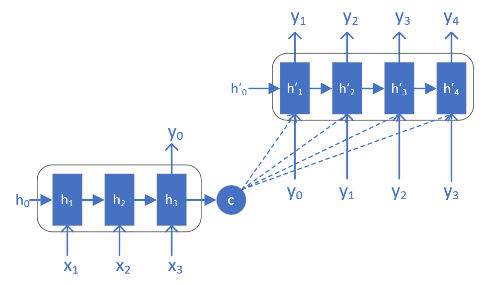
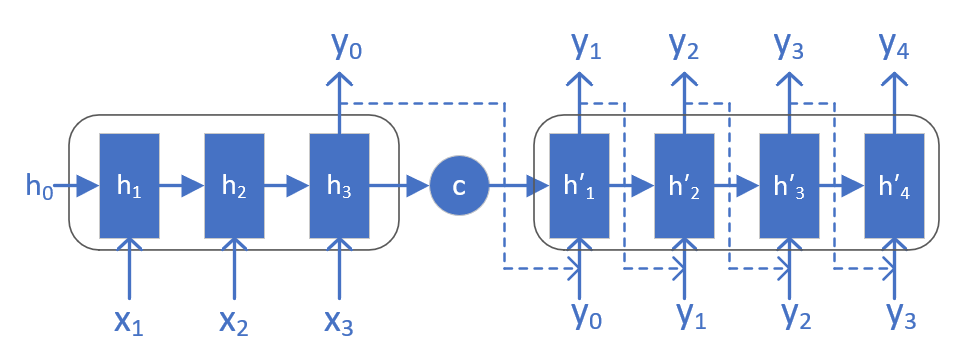

<!--
 * @Author: matiastang
 * @Date: 2022-08-08 17:15:32
 * @LastEditors: matiastang
 * @LastEditTime: 2022-08-08 17:18:11
 * @FilePath: /matias-AI/md/RNN/Seq2Seq.md
 * @Description: Seq2Seq
-->
# Seq2Seq

`序列到序列模型`在`自然语言`处理中应用广泛，是重要的模型结构。

前面章节讲到的RNN模型和实例，都属于序列预测问题，或是通过序列中一个时间步的输入值，预测下一个时间步输出值（如二进制减法问题）；或是对所有输入序列得到一个输出作为分类（如名字分类问题）。他们的共同特点是：输出序列与输入序列等长，或输出长度为1。

还有一类序列预测问题，以序列作为输入，需要输出也是序列，并且输入和输出序列长度不确定，并不断变化。这类问题被成为序列到序列（Sequence-to-Sequence, Seq2Seq）预测问题。

序列到序列问题有很多应用场景：比如机器翻译、问答系统（QA）、文档摘要生成等。简单的RNN或LSRM结构无法处理这类问题，于是科学家们提出了一种新的结构 —— `编码解码（Encoder-Decoder）`结构。

## 序列到序列模型（Seq2Seq）
Seq2Seq模型有两种常见结构

