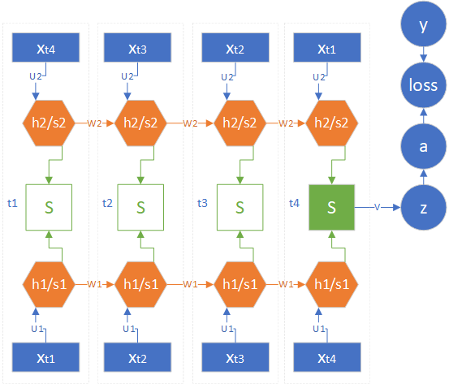

<!--
 * @Author: matiastang
 * @Date: 2022-08-08 17:01:18
 * @LastEditors: matiastang
 * @LastEditTime: 2022-08-08 17:04:23
 * @FilePath: /matias-AI/md/RNN/双向循环神经网络.md
 * @Description: 双向循环神经网络
-->
# 双向循环神经网络

`因为“过去”的时间步的状态对“未来”的时间步的状态有影响`即为`单向循环神经网络`。

前向计算：是指神经网络中通常所说的前向计算，包括正向循环的前向计算和逆向循环的前向计算。
反向传播：是指神经网络中通常所说的反向传播，包括正向循环的反向传播和逆向循环的反向传播。
正向循环：是指双向循环神经网络中的从左到右时间步。在正向过程中，会存在前向计算和反向传播。
逆向循环：是指双向循环神经网络中的从右到左时间步。在逆向过程中，也会存在前向计算和反向传播。

