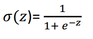
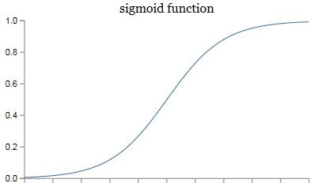

<!--
 * @Author: tangdaoyong
 * @Date: 2021-06-22 15:54:17
 * @LastEditors: tangdaoyong
 * @LastEditTime: 2021-06-22 15:58:21
 * @Description: 激活函数sigmoid
-->
# 激活函数sigmoid

`激活函数sigmoid`有一个用途，把z映射到[0,1]之间。上图中的横坐标是z，纵坐标我们用y’来表示，y’就代表了我们最终的预测结果。从图像可以看出，z越大那么y’就越靠近1，z越小那么y’就越靠近0。那为什么要把预测结果映射到[0,1]之间呢？因为这样不仅便于神经网络进行计算，也便于我们人类进行理解。例如在预测是否有猫的例子中，如果y’是0.8，就说明有80%的概率是有猫的。